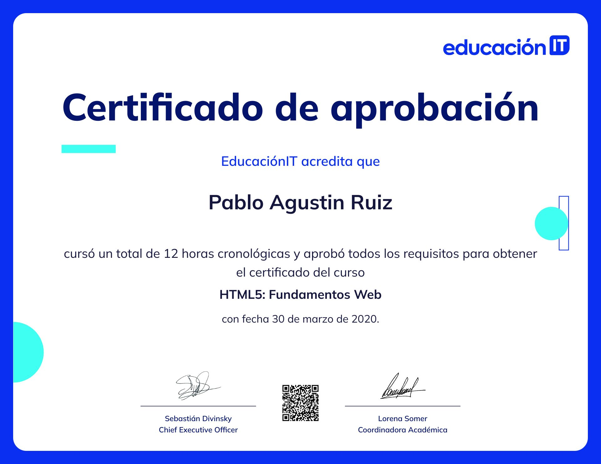
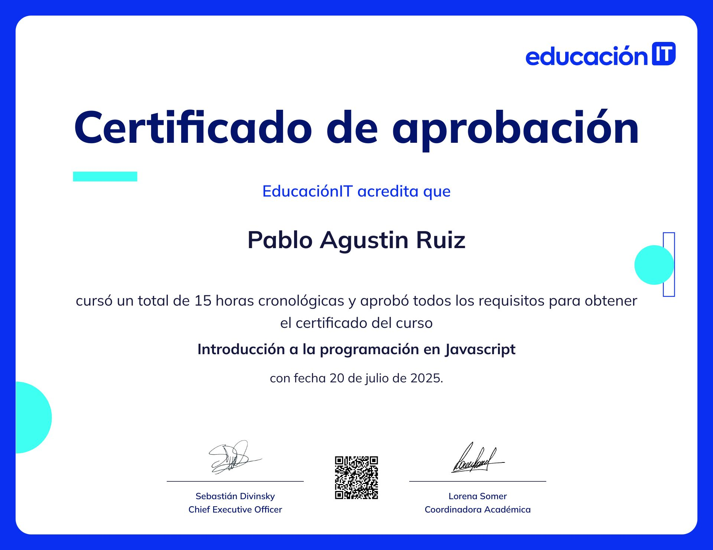
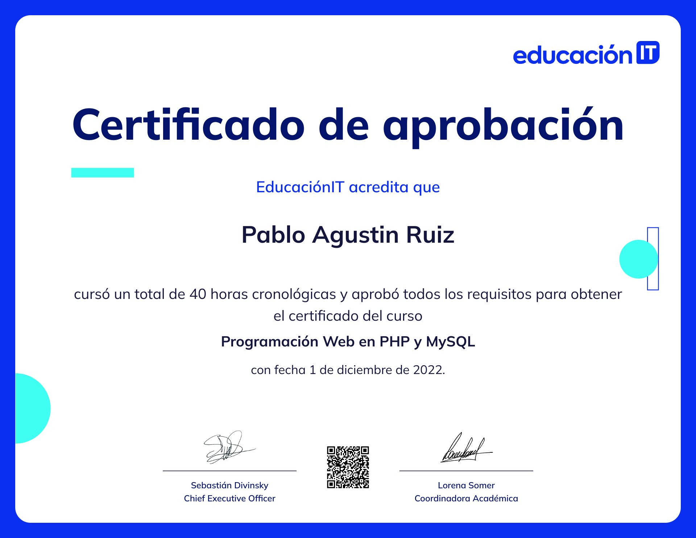
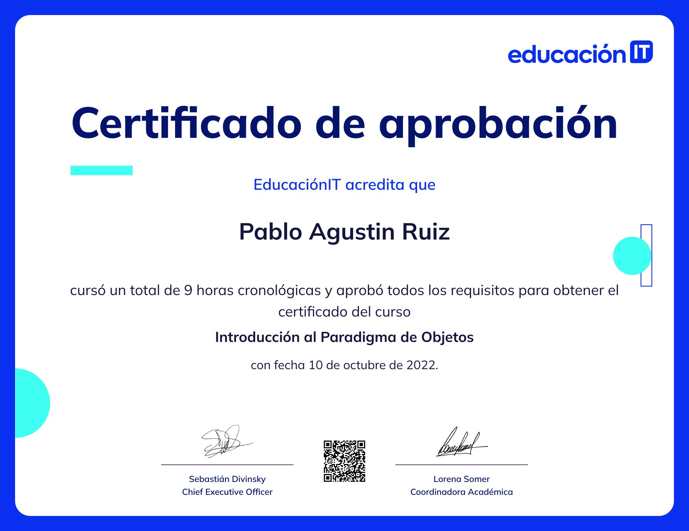

## Hi there 👋 I'm Pablo Ruiz

I'm a web development student with a background in customer service, content moderation, and QA testing. I'm currently expanding my technical skills and working on personal coding projects to grow as a full-stack developer.

### 🔭 I’m currently working on:
- Full-stack JavaScript projects (Node.js, Express, SQLite)
- Frontend interfaces using HTML, CSS, and Bootstrap
- RESTful APIs and database integrations

### 🌱 I’m currently learning:
- Advanced JavaScript concepts
- Test automation and manual QA
- Software architecture and backend logic

### 💼 Past experience includes:
- Game and application testing (stress testing, bug reporting)
- Remote customer support (Storyworth, Mixer)
- AI data training and content moderation (Lionbridge, Mixer)

### 📫 How to reach me:
- 📧 [pabloruiz1992@outlook.com.ar](mailto:pabloruiz1992@outlook.com.ar)
- 🔗 [LinkedIn](https://www.linkedin.com/in/pablo-agustin-ruiz/)

### Here are some of my certifications:
- [HTML5: Fundamentos Web](https://www.educacionit.com/perfil/pablo-agustin-ruiz-396151/certificado/41980?_gl=1*2e9q1c*_ga*MTc2NTgxMzAxNC4xNzUzMDEzMTg2*_ga_R8GR8LL2B8*czE3NTMwMTMxODYkbzEkZzEkdDE3NTMwMTgwNDEkajM2JGwxJGgxNDA2MTA4MTY5)

- [Introducción a la programación en Javascript](https://www.educacionit.com/perfil/pablo-agustin-ruiz-396151/certificado/40122?_gl=1*dduyoi*_ga*MTc2NTgxMzAxNC4xNzUzMDEzMTg2*_ga_R8GR8LL2B8*czE3NTMwMTMxODYkbzEkZzEkdDE3NTMwMTg0MTAkajMyJGwxJGgxNDA2MTA4MTY5)

- [Programación Web en PHP y MySQL](https://www.educacionit.com/perfil/pablo-agustin-ruiz-396151/certificado/40190?_gl=1*1wde5qc*_ga*MTc2NTgxMzAxNC4xNzUzMDEzMTg2*_ga_R8GR8LL2B8*czE3NTMwMTMxODYkbzEkZzEkdDE3NTMwMTg1NDAkajYwJGwxJGgxNDA2MTA4MTY5)

- [Introducción a Bases de Datos y SQL](https://www.educacionit.com/perfil/pablo-agustin-ruiz-396151/certificado/41977?_gl=1*1xfwh38*_ga*MTc2NTgxMzAxNC4xNzUzMDEzMTg2*_ga_R8GR8LL2B8*czE3NTMwMTMxODYkbzEkZzEkdDE3NTMwMTg2NDIkajYwJGwxJGgxNDA2MTA4MTY5)

- [Introducción al Paradigma de Objetos](https://www.educacionit.com/perfil/pablo-agustin-ruiz-396151/certificado/40125?_gl=1*11yat5m*_ga*MTc2NTgxMzAxNC4xNzUzMDEzMTg2*_ga_R8GR8LL2B8*czE3NTMwMTMxODYkbzEkZzEkdDE3NTMwMTg2OTAkajEyJGwxJGgxNDA2MTA4MTY5)

---
